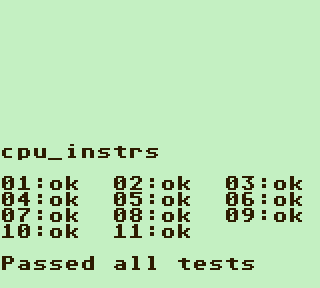
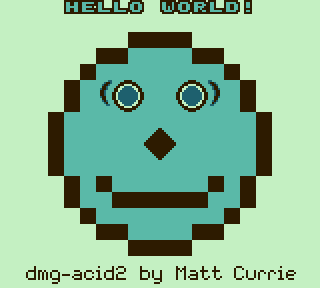
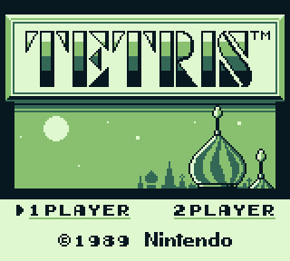
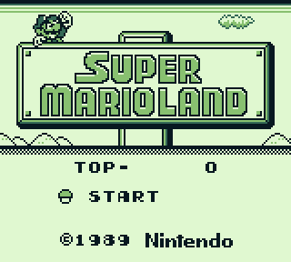
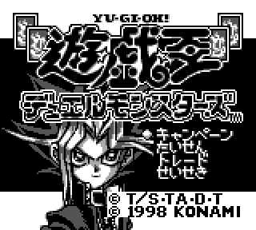
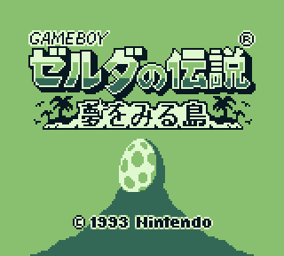
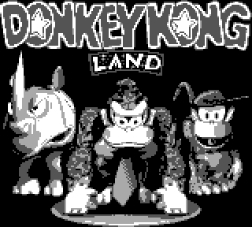
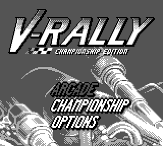

# <ruby>脳<rp>(</rp><rt>のう</rt><rp>)</rp></ruby><ruby>腐<rp>(</rp><rt>ふ</rt><rp>)</rp></ruby>

DMG-01 emulator written in modern C++ using Win32 API and SDL2. It is intended as a hobby project to sharpen my C++ skills. The emulator is not complete, so it might have some issues. Please don't hesitate to open an issue if you find any.

## Some Screenshots

 | 
 | 
 | 
 | 

## Features

- Able to emulate many of the common games with reasonable speed and accuracy.
- Configurable with `config.ini` (see the below section for more information).
- Accurate CPU emulation (passes Blargg's CPU tests).
- Adequate PPU emulation (passes [dmg-acid2](https://github.com/mattcurrie/dmg-acid2) test). This emulator uses Pixel FIFO, as opposed to common scanline renderer.
- Supported cartridge types: Plain ROM, MBC1, MBC1+RAM, and MBC1+RAM+BATTERY. MBC1 RAM savestates are supported.
- Ability to preview the background map up to three tiles.
- Allows custom colour palettes.
- Ability to take screenshots to `.bmp` files.

## `config.ini` Explained

When you run the emulator for the first time, the `config.ini` with default settings will be created. The example contents of the file is shown below
```
BootROMPath=C:\Users\Jimmy\OneDrive\Documents\git\noufu\ROMS\Boot\dmg_boot.bin
CPULogging=0
Color0=C4.F0.C2
Color1=5A.B9.A8
Color2=1E.60.6E
Color3=2D.1B.00
InterruptLogging=0
MMULogging=0
PreviewBackground=1
ScreenScaleFactor=2
UseBootROM=1
```

- `UseBootROM` - Set to 1 if you want to run the boot ROM at startup.

- `BootROMPath` - A path to the DMG boot ROM. This field is required if you set `UseBootROM` to 1.

- `Color0`, `Color1`, `Color2`, `Color3` - Colour palette to be used by PPU. Its values follow this format: `RED.GREEN.BLUE`. `RED`, `GREEN`, and `BLUE` must be written as 2-digit hexadecimal values. See `Colour Palettes` section for examples.

- `ScreenScaleFactor` - Sets the display size. If it is set to 1 then the resolution will be 160x144. If 2 then it will be 320x288, etc.

- `CPULogging` - If you want the emulator to log its CPU state (currently buggy and will make the emulation slower, so I don't recommend turning it on for now...).

- `InterruptLogging` - Log the state of interrupt manager if turned on (1).

- `MMULogging` - Log the state of MMU if turned on.

- `PreviewBackground` - Turn on if you want to preview the background map. The below is the demonstration of this feature.

[](https://user-images.githubusercontent.com/42195546/130702128-da022966-3b18-4513-ad36-ae5d6f4458f2.mp4)

~~*The status bar is flickering because I miscalculated when the VBlank period should end. It's already fixed, so don't worry about that. I will create the new demo video when I have time.*~~

## Keybindings

- <kbd>A</kbd> - 'A' button
- <kbd>S</kbd> - 'B' button
- <kbd>Enter</kbd> - 'start' button
- <kbd>Space</kbd> - 'select' button
- <kbd>&#8592;</kbd> - DPad left
- <kbd>&#8593;</kbd> - DPad up
- <kbd>&#8594;</kbd> - DPad right
- <kbd>&#8595;</kbd> - DPad down

## Build Instructions

Requirements:

- TDM-GCC v9.2.0 (x64)
- fmt v8.0.0 (already preinstalled in `include/3rdparty`)
- SDL v2.0.12 (optional)

Run `setup.bat` first before anything else.

To build, type
```
mingw32-make SDL=1
```
Remove `SDL=1` if you don't have SDL installed.

To clean, type
```
mingw32-make clean
```

## Releases

Currently there are 3 different builds for this emulator.

- `cli\` - Rudimentary CLI debugger.
- `gui\gdi` - GUI with Windows GDI32 graphics output.
- `gui\sdl` - GUI with SDL2 graphics output.

You can fetch yours [here](https://github.com/marethyu/noufu/releases).

## Colour Palettes

Colours can be modified in `config.ini`.

GameBoy Green (default)
```
Color0=E0.F8.D0
Color1=88.C0.70
Color2=34.68.56
Color3=08.18.20
```

Greyscale
```
Color0=FF.FF.FF
Color1=A9.A9.A9
Color2=54.54.54
Color3=00.00.00
```

SpazeHaze
```
Color0=F8.E3.C4
Color1=CC.34.95
Color2=6B.1F.B1
Color3=0B.06.30
```

Mist GB
```
Color0=C4.F0.C2
Color1=5A.B9.A8
Color2=1E.60.6E
Color3=2D.1B.00
```

## Acknowledgements

This project wouldn't be possible if it weren't for [infamous pandocs](https://gbdev.io/pandocs/) and the awesome [emudev](https://emudev.org/) community, especially its Discord server. I get a lot of my questions answered there. Also, I owe a lot to [Optix's GBEDG](https://hacktixme.ga/GBEDG/). It helped me to understand and implement PPU's pixel FIFO rendering algorithm.